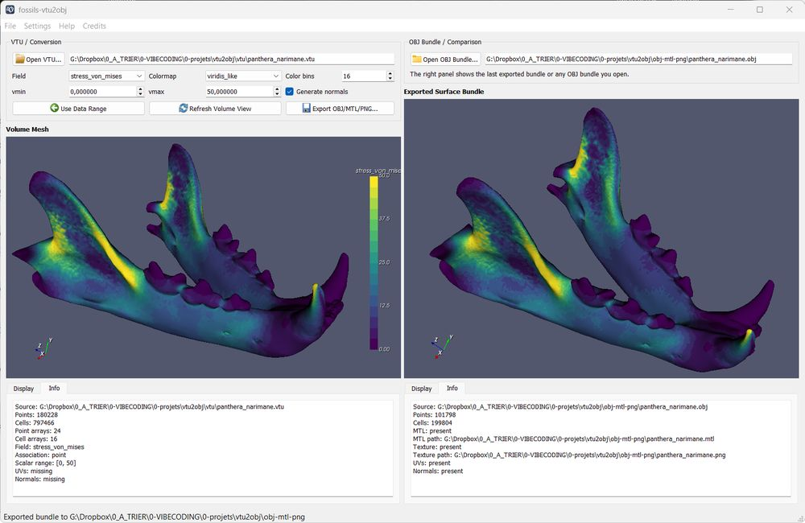
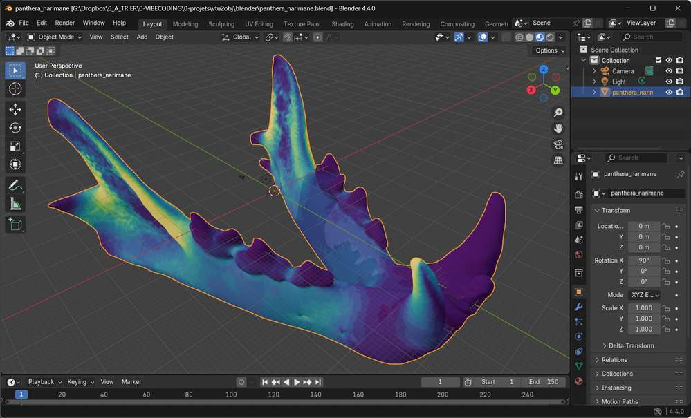

# fossils-vtu2obj

`fossils-vtu2obj` converts FEM results stored in **VTK XML Unstructured Grid**
files (`.vtu`) into:

- an extracted surface mesh,
- an OBJ file with UV coordinates,
- a PNG palette texture generated from a selected scalar field,
- and a matching MTL file for straightforward Blender import.

The project targets post-processing workflows around the **fossils** finite
element solver and keeps the core conversion pipeline **VTK-only**.





## Current status

The first useful milestone is now implemented:

- VTU loading and dataset inspection,
- surface extraction with VTK,
- scalar and textured preview with VTK,
- palette texture PNG generation,
- UV generation from scalar values,
- OBJ/MTL/PNG export,
- CLI with `inspect`, `list-arrays`, `preview`, `convert`, and `gui`,
- minimal PyQt5 GUI,
- deterministic test suite and linting.

The repository also stays ready for a future optional `C++ + SWIG` bridge via
the reserved `native/` and `integrations/` areas.

## Supported scalar fields

The current conversion and preview pipeline supports:

- scalar **point-data** arrays directly,
- scalar **cell-data** arrays after VTK conversion to point data on the
  extracted surface.

Multi-component fields such as vectors and tensors are listed by inspection but
cannot yet be used directly as conversion fields.

## Why the texture is a palette image

This project intentionally avoids diagonal-only textures.

Instead, it generates a robust 2D palette texture:

- the image width matches the number of discrete color bins,
- every row repeats the same palette,
- the scalar value is mapped to the `U` coordinate,
- the `V` coordinate stays constant.

That makes the exported OBJ/MTL/PNG bundle more stable under downstream texture
filtering in tools such as Blender.

## Installation

Base install:

```bash
pip install -e .
```

Development tools:

```bash
pip install -e .[dev]
```

GUI dependencies:

```bash
pip install -e .[gui]
```

## Build a Windows installer

You can generate redistributable Windows binaries with **PyInstaller** and a
setup executable with **Inno Setup**.

Prerequisites:

- install development and GUI dependencies,
- install Inno Setup 6 (provides `ISCC.exe`).

```bash
pip install -e .[gui,dev]
```

Run the full packaging pipeline from the repository root:

```powershell
powershell -ExecutionPolicy Bypass -File build_installer.ps1
```

Useful variants:

```powershell
# Skip PyInstaller and only rebuild the setup executable
powershell -ExecutionPolicy Bypass -File build_installer.ps1 -SkipPyInstaller

# Skip Inno Setup and only rebuild the one-dir application bundle
powershell -ExecutionPolicy Bypass -File build_installer.ps1 -SkipInno
```

Generated outputs:

- `dist/fossils_vtu2obj/` (one-dir bundle with `fossils-vtu2obj.exe` and
  `fossils-vtu2obj-gui.exe`),
- `dist/installer/` (final setup executable produced by Inno Setup).

## CLI usage

Inspect a file:

```bash
fossils-vtu2obj inspect examples/beam3d.vtu
```

List arrays:

```bash
fossils-vtu2obj list-arrays examples/beam3d.vtu
```

Preview a scalar field:

```bash
fossils-vtu2obj preview examples/beam3d.vtu \
  --field stress_von_mises \
  --colormap rainbow
```

Preview the textured result:

```bash
fossils-vtu2obj preview examples/beam3d.vtu \
  --field stress_von_mises \
  --colormap rainbow \
  --textured
```

Convert to OBJ/MTL/PNG:

```bash
fossils-vtu2obj convert examples/beam3d.vtu out/beam \
  --field stress_von_mises \
  --colormap rainbow \
  --vmin 0 \
  --vmax 120 \
  --n-colors 256
```

Convert without normals:

```bash
fossils-vtu2obj convert examples/beam3d.vtu out/beam_raw \
  --field stress_von_mises \
  --no-normals
```

Convert a cell-data field:

```bash
fossils-vtu2obj convert examples/beam3d.vtu out/beam_cell \
  --field cell_stress_von_mises \
  --colormap cool_to_warm \
  --n-colors 256
```

Launch the GUI:

```bash
fossils-vtu2obj gui
```

## Example dataset

The repository includes [beam3d.vtu](examples/beam3d.vtu) as a real sample
produced by `fossils`.

On this file, the current inspection reports:

- `264` points,
- `150` volume cells,
- `24` point arrays,
- `16` cell arrays.

Useful scalar fields include:

- `stress_von_mises`
- `strain_von_mises`
- `cell_stress_von_mises`
- `cell_strain_von_mises`

## Blender workflow

The intended workflow is:

1. run `convert`,
2. import the generated OBJ into Blender,
3. let Blender load the accompanying MTL,
4. verify that the material references the generated PNG texture.

Because the UVs encode the scalar field directly, no unwrap or bake step is
needed in Blender for the current workflow.

By default the converter also writes point normals into the OBJ when possible.
If you want a more minimal geometry export, use `--no-normals`.

## Project layout

```text
.
|-- AGENTS.md
|-- README.md
|-- pyproject.toml
|-- native/
|   `-- README.md
|-- src/
|   `-- fossils_vtu2obj/
|       |-- __init__.py
|       |-- __main__.py
|       |-- arrays.py
|       |-- cli.py
|       |-- colormaps.py
|       |-- export_obj.py
|       |-- io_vtk.py
|       |-- logging_utils.py
|       |-- model.py
|       |-- preview.py
|       |-- surface.py
|       |-- texture.py
|       |-- uvmap.py
|       |-- integrations/
|       |   |-- __init__.py
|       |   `-- fossils.py
|       `-- gui/
|           |-- __init__.py
|           |-- app.py
|           |-- main_window.py
|           `-- vtk_view.py
`-- tests/
    |-- conftest.py
    |-- test_arrays.py
    |-- test_cli.py
    |-- test_colormaps.py
    |-- test_export_obj.py
    |-- test_gui.py
    |-- test_integrations.py
    |-- test_preview.py
    |-- test_surface.py
    |-- test_texture.py
    `-- test_uvmap.py
```

## Optional future native integration

The future native integration is planned as an **optional bridge**, not as a
replacement for the VTK conversion code.

- `src/fossils_vtu2obj/integrations/` is the Python-facing boundary.
- `native/` is reserved for future `C++ + SWIG` sources and build files.
- the default CLI and test suite must keep working even when no native bridge
  is installed.

The bootstrap uses `setuptools.build_meta` today because it keeps the pure
Python package simple while preserving a later migration path toward a more
CMake-oriented backend if the native bridge becomes real.

## Known limits

- preview and conversion currently require a scalar field, not a vector or
  tensor field,
- GUI preview tests use a non-embedded fallback mode in headless CI because
  offscreen Windows OpenGL is fragile with the Qt VTK widget,
- the GUI persists only a lightweight subset of settings for now,
- there is no dedicated normals control yet in the CLI preview path.

## Development

Run the default checks with:

```bash
python -m ruff check .
python -m pytest -q
```
